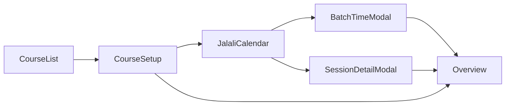

# Business Context: Entities and User Flow

This document is the single reference for **domain entities** and **user flow** so the team and tooling share the same mental model.

## Entities (Domain Model)

### Course

A course is an educational event (e.g. a training or class). It has:

- **id** (string): Unique identifier.
- **name** (string): Display name.
- **description** (optional): Course description (from setup).
- **hoursPerSession** (optional number): Hours per session.
- **durationDays** (optional number): Number of days the course runs; caps how many session dates can be selected.
- **selectedDates** (optional string[]): Jalali date keys (`YYYY-MM-DD`) for each session day. Order is typically sorted.
- **sessionTimes** (optional Record<dateKey, string>): Start time per session date, format `"HH:mm"`.
- **sessionDetails** (optional Record<dateKey, SessionDetail>): Per-session title, description, and file references.

### Session

A **session** is one occurrence of a course on a specific date. It is identified by `(courseId, dateKey)` where `dateKey` is a Jalali date `YYYY-MM-DD`. A session has:

- Optional **time** (from `course.sessionTimes[dateKey]`).
- Optional **SessionDetail** (from `course.sessionDetails[dateKey]`): title, description, and attached files.

There is no separate “Session” table or type; sessions are derived from a course’s `selectedDates` and the corresponding `sessionTimes` and `sessionDetails`.

### SessionDetail

Per-session metadata, keyed by `dateKey` in `course.sessionDetails`:

- **title** (optional string): Session title or name.
- **description** (optional string): Session description.
- **files** (optional SessionFile[]): Attached documents for this session.

### SessionFile

A file attached to a session. Metadata lives in `sessionDetails[dateKey].files`; the binary is stored on disk.

- **id** (string): Unique file identifier.
- **savedName** (string): Unique filename on disk (e.g. `<id>.<ext>`).
- **originalName** (string): Display name (user can edit).
- **description** (optional string): User-provided description for the file.

Files are stored under `data/course-sessions/<courseId>/`. Only metadata is in `courses.json`.

---

## User Flow (Journey)

1. **Create course** – User adds a course by name (CourseList).
2. **Setup** – User optionally sets description, hours per session, and duration days (CourseSetup). Total hours = hoursPerSession × durationDays; duration caps how many dates can be selected.
3. **Select session dates** – User picks session days in the Jalali calendar (up to `durationDays`). Dates are stored in `course.selectedDates`.
4. **Set session times** – User can set start times in bulk (BatchSessionTimeModal) or leave them unset. Stored in `course.sessionTimes`.
5. **Per-session details** – User can add title, description, and file uploads per session (SessionDetailModal / SessionCard). Stored in `course.sessionDetails` and `data/course-sessions/<courseId>/`.
6. **View overview** – The overview card (in CourseSetup) shows: start/end dates, days until start / days passed, sessions held vs left, sessions without time, completion %, next session. Completion is based on sessions that have both a time and at least one of (title, description, or files).

---

## Where It Lives in Code

| Concern | Location |
|--------|----------|
| Types | [lib/courses.ts](../lib/courses.ts): `Course`, `SessionDetail`, `SessionFile`, `CoursesData` |
| Server-only data | [lib/courses-server.ts](../lib/courses-server.ts): `readCoursesData`, `writeCoursesData`, `getCourseSessionsDir` |
| APIs | GET/POST `/api/courses`; PATCH `/api/courses/[id]` (selectedDates, sessionTimes, sessionDetails); POST/GET/DELETE `/api/courses/[id]/session-files` and `.../session-files/[fileId]` |
| UI – list & setup | [components/course-list.tsx](../components/course-list.tsx), [components/course-setup.tsx](../components/course-setup.tsx) |
| UI – calendar & sessions | [components/jalali-calendar/index.tsx](../components/jalali-calendar/index.tsx), [components/jalali-calendar/batch-session-time-modal.tsx](../components/jalali-calendar/batch-session-time-modal.tsx), [components/jalali-calendar/session-card.tsx](../components/jalali-calendar/session-card.tsx), [components/jalali-calendar/session-detail-modal.tsx](../components/jalali-calendar/session-detail-modal.tsx) |
| Jalali dates | [lib/jalali.ts](../lib/jalali.ts): formatting, parsing, calendar helpers |

When adding or changing features that touch courses or sessions, keep naming and behavior consistent with this document (e.g. session = one date in a course; `sessionDetails` keyed by Jalali `dateKey`).
